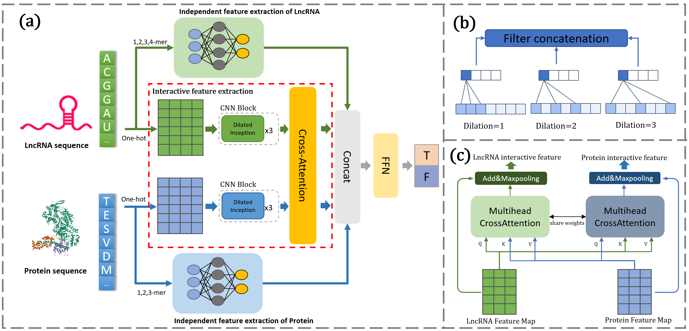

#  LPIGLAM

***The official PyTorch implementation of "Predicting Plant LncRNA-Protein Interactions through Global and Local features based on Attention Mechanism".***

##  Dependencies

Dependencies:
- python 3.7
- pytorch 1.10.0
- numpy
- sklearn
- tqdm
- prefetch_generator
  
##  Usage

`python main.py <dataset> `

Parameters:
- `dataset` : `ATH`, `ZEA` , `NPInter` 
##  Project Structure

This project contains the following:

- Datasets:

  - ATH: 1896 Arabidopsis thaliana LPIs data

  - ZEA: 44266 Zea mays LPIs data

  - NPInter: 8316 Human LPIs data

- Assets:

  - Model_Figure: Diagram of the model architecture

- Utils: A series of tools.
- LossFunction.py: Custom loss function defined in the paper.
- README.md: Documentation.
- RunModel.py: Scripts for training, validation, and testing the model.
- Config.py: Configuration file for the model.
- Main.py: Main execution script.
- Model.py: Implementation of the proposed model described in the paper. 
